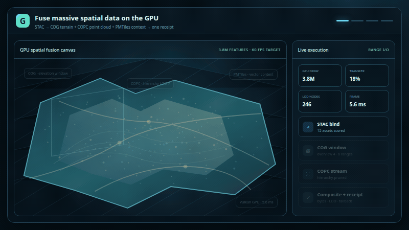
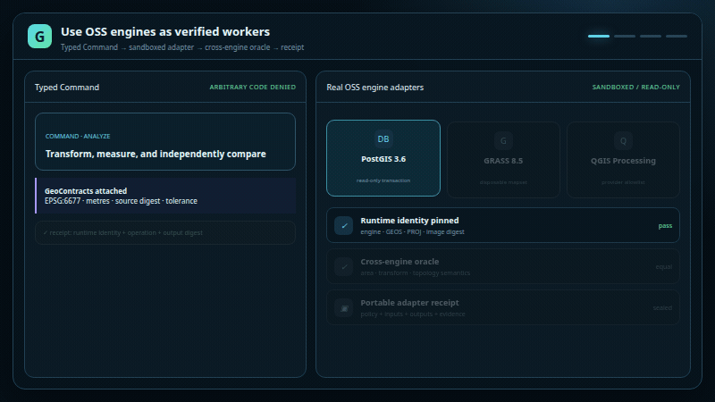
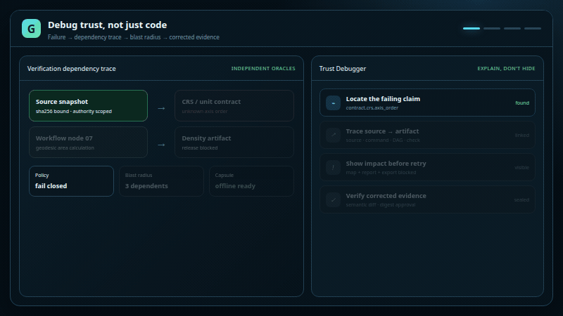
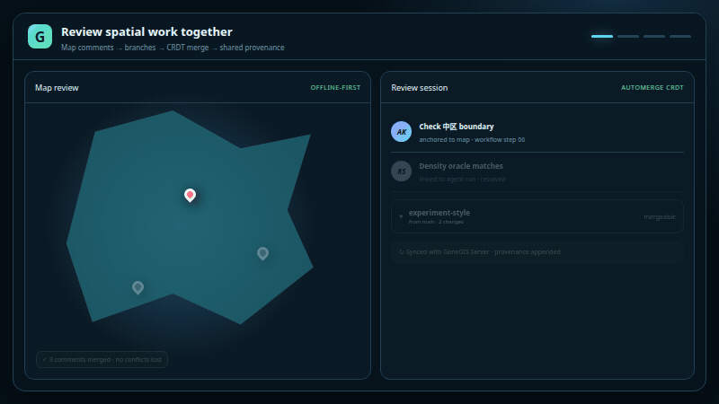
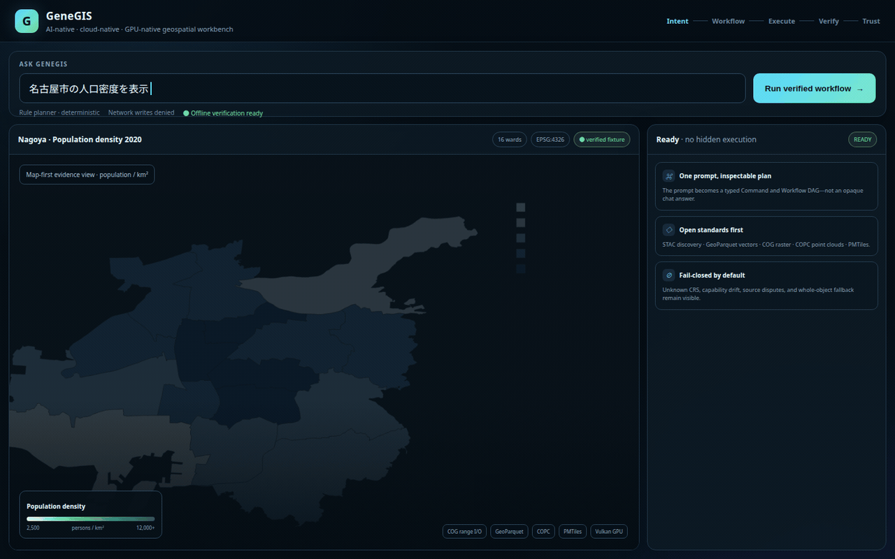

# GeneGIS

**AI-native · Cloud-native · GPU-native open geospatial workbench**

## Feature showcase

<table>
  <tr>
    <td width="50%" align="center">
      <br />
      <sub><strong>Measured multi-format selected view</strong><br />GeoParquet · COG · COPC · PMTiles · real wgpu evidence</sub>
    </td>
    <td width="50%" align="center">
      <br />
      <sub><strong>Cross-engine spatial verification</strong><br />PostGIS · GRASS · QGIS Processing · independent numerical oracle</sub>
    </td>
  </tr>
  <tr>
    <td width="50%" align="center">
      <br />
      <sub><strong>Map-linked Trust Debugger</strong><br />Evidence graph · blast radius · semantic diff · offline capsule</sub>
    </td>
    <td width="50%" align="center">
      <br />
      <sub><strong>Live semantic map review</strong><br />Cursors · anchored evidence · branch diff · Automerge CRDT</sub>
    </td>
  </tr>
</table>

The cloud-view numbers are injected from the reproducible
[`readme-cloud-selected-view.json`](docs/reports/readme-cloud-selected-view.json)
artifact: four production readers run parallel HTTP Range selections, reject
whole-object fallback, and hand off to a measured headless wgpu frame. Metrics
are scoped to the recorded adapter and run—not presented as universal hardware
claims—and regenerate with `scripts/render-readme-hero.sh`.

### End-to-end verified workflow

<p align="center">
  
</p>

<p align="center"><sub>Intent → typed Workflow DAG → range-aware execution → independent checks → offline-verifiable Source Assurance</sub></p>

> If GIS were invented in 2026, it would not look like a 2000s desktop app.

GeneGIS is **not a QGIS clone**. It is a next-generation GIS platform built around workflow graphs, AI agents, cloud-optimized formats, and GPU rendering — designed for spatial intelligence in the GeoAI era.

<p align="center">
  <a href="https://genegis-playground.rsasaki0109.chatgpt.site"><strong>Open the zero-install Playground →</strong></a>
</p>

No install and no API key: run the North Star prompt, inspect all 14 workflow
operations, verify CRS and units, follow the sources, and share a reproducible
result URL. The public alpha replays a committed artifact generated and verified
by the Rust core.

## Why GeneGIS exists

Traditional GIS asks you to find data, fix CRS, wire geoprocessing by hand, validate results yourself, and export maps elsewhere. GeneGIS inverts that:

**Intent → Data Discovery → Workflow Graph → Verified Execution → Map / Insight / Report**

Example north-star prompt:

```text
名古屋市の人口密度を表示
```

GeneGIS resolves the place, discovers datasets, normalizes CRS, computes density, renders a choropleth, and shows sources + workflow graph + verification — not just a chat reply.

The Nagoya fixture uses the [Nagoya City 2020 census final-value page](https://www.city.nagoya.jp/shisei/toukei/1003703/1003773/1003809/1034253/1003818.html)
and its [official census table Excel](https://www.city.nagoya.jp/_res/projects/default_project/_page_/001/003/818/toukeihyo.xlsx)
for population, with MLIT N03 boundaries and an immutable source manifest/oracle
under `/home/sasaki/workspace/GeneGIS/examples/nagoya-population-density/data/`.

### The differentiation: proof-carrying spatial analysis

GeneGIS does not compete by reproducing a desktop layer editor or by claiming
that a prompt, DAG, or provenance log proves correctness. Every releasable
analysis carries machine-checkable meaning and evidence:

- versioned GeoContracts for CRS, units, measure, time, coverage, source, and quality;
- policy-derived trust that fails closed instead of accepting model confidence;
- an independent Verification Graph with verifier identity and tolerance;
- a ten-subject open capsule that verifies offline without a server or LLM;
- semantic diff and digest-bound approval;
- a Trust Debugger linking failures to sources, contracts, Workflow nodes, checks, and artifacts;
- PROV-JSON, Workflow Run RO-Crate, OpenLineage, DSSE/in-toto, and OGC API - Processes projections;
- measured Native/DuckDB/GDAL and licensed external-benchmark artifact scoring.

This makes the product a review and verification workbench around open GIS
engines, rather than another toolbox UI. See
[`RFC 0003`](docs/rfcs/0003-proof-carrying-spatial-analysis.md) and the
measured [`Phase-11 report`](docs/reports/phase-11-acceptance.json).

## Five differentiators

| Pillar | What it means |
|--------|----------------|
| **AI Agent Native** | Agents plan and verify spatial workflows, not just chat |
| **Cloud Native Data First** | GeoParquet, COG, COPC, PMTiles, STAC as first-class citizens |
| **GPU First** | LOD, tiles, range reads — never load billions of features wholesale |
| **Figma for GIS** | Collaboration, comments, branches, style systems at the center |
| **VSCode for GIS** | WASM / TS / Rust / Python SDK + marketplace extensibility |

## Try it in 30 seconds

The fastest path is the [public Playground](https://genegis-playground.rsasaki0109.chatgpt.site).
For local execution:

```bash
# North-star one-liner (Intent → Workflow → Map)
cargo run -p genegis-cli -- ask "名古屋市の人口密度を表示"

# Inspect the workflow without executing it
cargo run -p genegis-cli -- ask "名古屋市の人口密度を表示" --plan-only

# Seal, inspect, and verify a portable proof-carrying result
cargo run -p genegis-cli -- capsule seal /tmp/nagoya-capsule
cargo run -p genegis-cli -- capsule review /tmp/nagoya-capsule --tui
cargo run -p genegis-cli -- capsule verify /tmp/nagoya-capsule \
  --policy /tmp/nagoya-capsule/metadata/verification-policy.json
```

### Develop the public Playground

```bash
cargo run -p genegis-analysis --example export_playground -- public/demo
npm ci
npm run check
npm run dev
```

See [`docs/adr/0005-public-playground.md`](docs/adr/0005-public-playground.md)
for the verified-replay architecture.

### Federated STAC → verified GeoParquet

The local Workbench can search multiple STAC endpoints, compare every returned
asset, explain the selected GeoParquet, bind it through a typed Command +
GeoWorkflow, execute row group 0 with HTTP Range requests, and return one
machine-readable verification receipt. Candidate checks cover media type, data
role, source coverage, CRS, units, and license.

External network access is fail-closed. Before adding a remote STAC endpoint,
allow its API host and any separate asset host:

```bash
GENEGIS_REMOTE_ALLOWED_HOSTS=earth-search.aws.element84.com,example-bucket.s3.amazonaws.com \
  cargo run -p genegis-workbench
```

See
[`docs/adr/0006-federated-stac-asset-binding.md`](docs/adr/0006-federated-stac-asset-binding.md)
and the
[`federated asset E2E`](crates/genegis-catalog/tests/federated_asset_e2e.rs).

## Architecture at a glance

```
Intent → GeoWorkflow IR → Verified Execution → Map
              ↑
         AI + CLI + UI (all emit Commands)
              ↓
    GIS Core (Rust) + DuckDB + wgpu + Cloud formats
```

See [`docs/architecture/overview.md`](docs/architecture/overview.md) and [`docs/rfcs/0001-master-architecture.md`](docs/rfcs/0001-master-architecture.md).

## Repository layout

```
crates/     Rust engines (core, render, workflow, ai, …)
apps/       Desktop (Tauri), web, server, CLI shells
plugins/    Official and community extensions
sdk/        Rust, TypeScript, Python SDK
docs/       Architecture, ADRs, RFCs, roadmap
examples/   Reproducible demos (Nagoya density, COG, COPC, …)
```

## Roadmap

| Phase | Theme |
|-------|-------|
| 4 | [Plugins & COPC — SDK, WASM host, point cloud alpha](docs/roadmap/phase-4-plugins.md) |
| 5 | [Figma for GIS — comments, branches, collab sync](docs/roadmap/phase-5-collab.md) |
| 6 | [Autonomous GIS platform — multi-agent orchestration](docs/roadmap/phase-6-autonomous.md) |
| 7 | [Audit trail & release workbench — run history + provenance UI](docs/roadmap/phase-7-release.md) |
| 8 | [Intent expansion — multi-workflow agent verify beyond Nagoya](docs/roadmap/phase-8-intent-expansion.md) |
| 10 | [Federated catalog search and cloud execution](docs/roadmap/phase-10-federated-catalog.md) |
| 11 | [Proof-carrying spatial analysis](docs/roadmap/phase-11-proof-carrying-analysis.md) |

## Tech stack (decisions)

- **Core:** Rust
- **Rendering:** wgpu / WebGPU
- **Desktop:** Tauri + TypeScript UI
- **Local analytics:** DuckDB Spatial
- **Cloud vectors:** GeoParquet
- **Enterprise DB:** PostGIS

## Contributing

See [CONTRIBUTING.md](CONTRIBUTING.md). We use RFC culture for major design changes.

## License

Licensed under Apache-2.0 OR MIT at your option.

---

**GeneGIS is not a GIS with AI. GeneGIS is a GIS designed for AI agents and humans to collaborate.**
