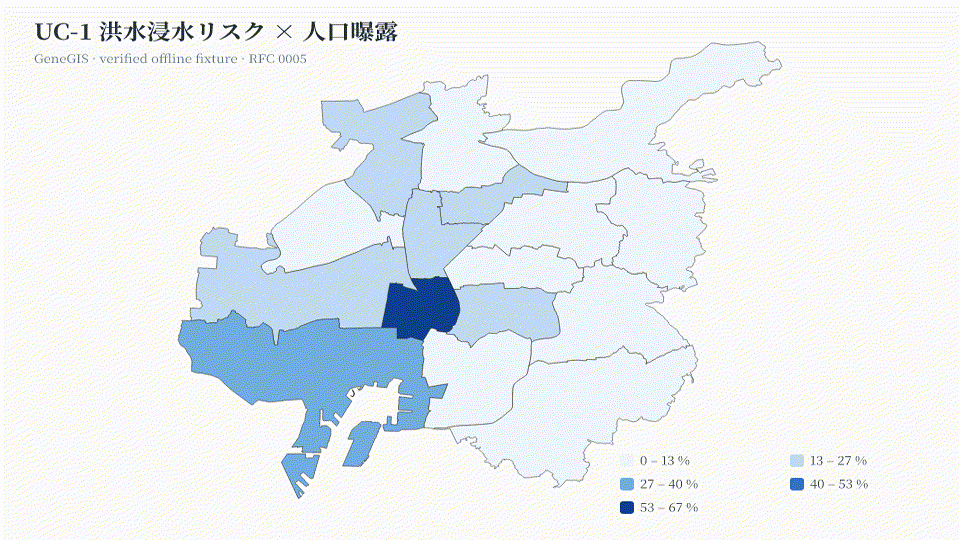

# GeneGIS

**Verified spatial workflows from intent to map.**

AI-native · Cloud-native · GPU-native · Open source

## Feature showcase

<table>
  <tr>
    <td width="50%" align="center">
      <br />
      <sub><strong>Cloud selected view</strong><br />GeoParquet · COG · COPC · PMTiles · wgpu</sub>
    </td>
    <td width="50%" align="center">
      <br />
      <sub><strong>OSS engine verification</strong><br />PostGIS · GRASS · QGIS Processing</sub>
    </td>
  </tr>
  <tr>
    <td width="50%" align="center">
      <br />
      <sub><strong>Trust Debugger</strong><br />Evidence graph · semantic diff · offline capsule</sub>
    </td>
    <td width="50%" align="center">
      <br />
      <sub><strong>Spatial collaboration</strong><br />Comments · branches · Automerge CRDT</sub>
    </td>
  </tr>
</table>

Cloud metrics come from a reproducible
[`evidence artifact`](docs/reports/readme-cloud-selected-view.json), not a product claim.

### One prompt, inspectable end to end

<p align="center">
  
</p>

<p align="center">
  <a href="https://genegis-playground.rsasaki0109.chatgpt.site"><strong>Open the zero-install Playground →</strong></a>
</p>

## Five flagship use cases, one verified pipeline

Every RFC 0005 application case runs as an agent-executable workflow with a
named verifier and an audit receipt — offline, deterministic, fail-closed:

<p align="center">
  
</p>

| Prompt | Workflow | Verifier |
|---|---|---|
| 「名古屋市の人口密度を表示」 | `nagoya-density` | DuckDB re-aggregation |
| 「名古屋市の洪水浸水リスクと人口曝露を表示」 | `nagoya-flood-exposure` | `duckdb_verify` |
| 「名古屋市の洪水浸水リスクと避難所アクセシビリティを表示」 | `nagoya-evacuation-access` | `route_sanity_verify` |
| 「名古屋市の15分都市アクセシビリティを表示」 | `nagoya-xmin-city` | `route_sanity_verify` |
| 「名古屋周辺のNDVI時系列をSentinel-2から作成して検証」 | `sentinel-ndvi-timeseries` | `index_range_verify` |
| 「2時期の点群から建物・植生の変化を抽出して検証」 | `copc-change-detect` | `volume_delta_verify` |

Frames are synthetic offline fixtures, regenerated bit-stable by
`cargo run -p genegis-cli -- demo frames` + `scripts/build-readme-showcase.sh`
(spec: [`docs/rfcs/0005-application-use-cases.md`](docs/rfcs/0005-application-use-cases.md)).

GeneGIS turns intent into a typed Workflow DAG, executes through open GIS
engines, and returns a map with CRS, units, sources, provenance, and independent
checks. It is a verification workbench—not a QGIS clone.

North-star prompt:

```text
名古屋市の人口密度を表示
```

## Why it is different

- Every operation flows through Command + Workflow Graph.
- GeoParquet, COG, COPC, PMTiles, and STAC use bounded cloud reads.
- PostGIS, GRASS, QGIS Processing, GDAL, and DuckDB remain interoperable workers.
- Trust fails closed and ships as an offline-verifiable evidence capsule.
- Map comments, branches, semantic diff, and provenance support review.

## Run

```bash
# Prompt → verified map
cargo run -p genegis-cli -- ask "名古屋市の人口密度を表示"

# Inspect without executing
cargo run -p genegis-cli -- ask "名古屋市の人口密度を表示" --plan-only

# Rebuild measured README evidence and GIFs
bash scripts/render-readme-hero.sh

# Rebuild the RFC 0005 use-case showcase GIF
cargo run -p genegis-cli -- demo frames && bash scripts/build-readme-showcase.sh
```

## Architecture

```text
Intent → Command → GeoWorkflow → Verified Execution → Map / Report
                         ↓
       Rust core · OSS adapters · cloud formats · wgpu
```

Core: Rust · UI: TypeScript/Tauri · plugins: Python/WASM · analytics: DuckDB

## Read more

- [Architecture](docs/architecture/overview.md)
- [Master RFC](docs/rfcs/0001-master-architecture.md)
- [Proof-carrying analysis](docs/rfcs/0003-proof-carrying-spatial-analysis.md)
- [Roadmap](docs/roadmap/phase-11-proof-carrying-analysis.md)
- [Contributing](CONTRIBUTING.md)

Apache-2.0 OR MIT
